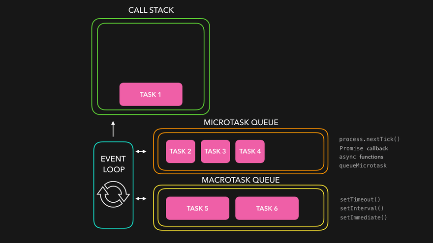

# 이벤트 루프

## 정의
자바스크립트는 싱글 스레드 언어로, 한 번에 하나의 작업만 수행할 수 있다.
 하지만 비동기 작업을 처리하기 위해 이벤트 루프가 콜백을 관리하고, 비동기 작업이 완료되면 이를 실행하기 위해 이벤트 큐에 넣는다.
> 자바스크립트의 비동기 코드 실행을 처리하는 매커니즘

## 자바스크립트 엔진
- **메모리 힙**
 객체, 배열, 함수 등의 데이터가 저장되는 공간

- **콜 스택**
 자바스크립트의 할 일 목록. 함수를 호출하게 되면 해당 함수의 정보가 콜 스택에 쌓이게 되고, 선입후출 구조.

- **웹 API**
 브라우저가 제공하는 다양한 기능들. ex. HTTP요청, `setTimeout`등의 기능들이 포함.

- **콜백 큐**
 비동기 작업의 결과나 나중에 실행되어야 하는 작업들이 대기하는 공간.

### 💡 콜백 큐의 죵류
1. **태스크 큐**
 `setTimeout`, `setInterval`등의 비동기 작업

2. **마이크로태스크 큐**
 `Promise`의 콜백 함수나 `async`,`await`과 같은 코드

3. **애니메이션 프레임**
 `requestAnimationFrames`과 같은 브라우저 환경에서 화면을 업데이트하는 작업

> 마이크로태스크 큐 > 애니메이션 프레임 > 태스크 큐 순으로 실행되는 우선순위를 가진다.

 

## 이벤트 루프
이벤트 루프는 콜 스택과 콜백 큐를 지속적으로 확인하며, 콜 스택이 비어있으면 콜백 큐에서 작업을 꺼내서 콜 스택으로 옮긴다.

### 동작 과정
1. **콜 스택 확인**
 이벤트 루프는 먼저 현재 콜 스택이 비어 있는지 확인한다.

2. **콜백 큐 확인**
  콜 스택이 비어있다면, 콜백 큐를 확인한다. 콜백 큐에는 웹 API 등에서 생성된 콜백 함수들이 대기한다.

3. **함수 이동**
 콜백 큐에서 가장 먼저 들어온 함수를 꺼내서 콜 스택으로 옮긴다.

4. **함수 실행**
 해당 함수가 콜 스택에서 실행되고 실행이 끝나면 콜 스택에서 빠져나가게 된다.