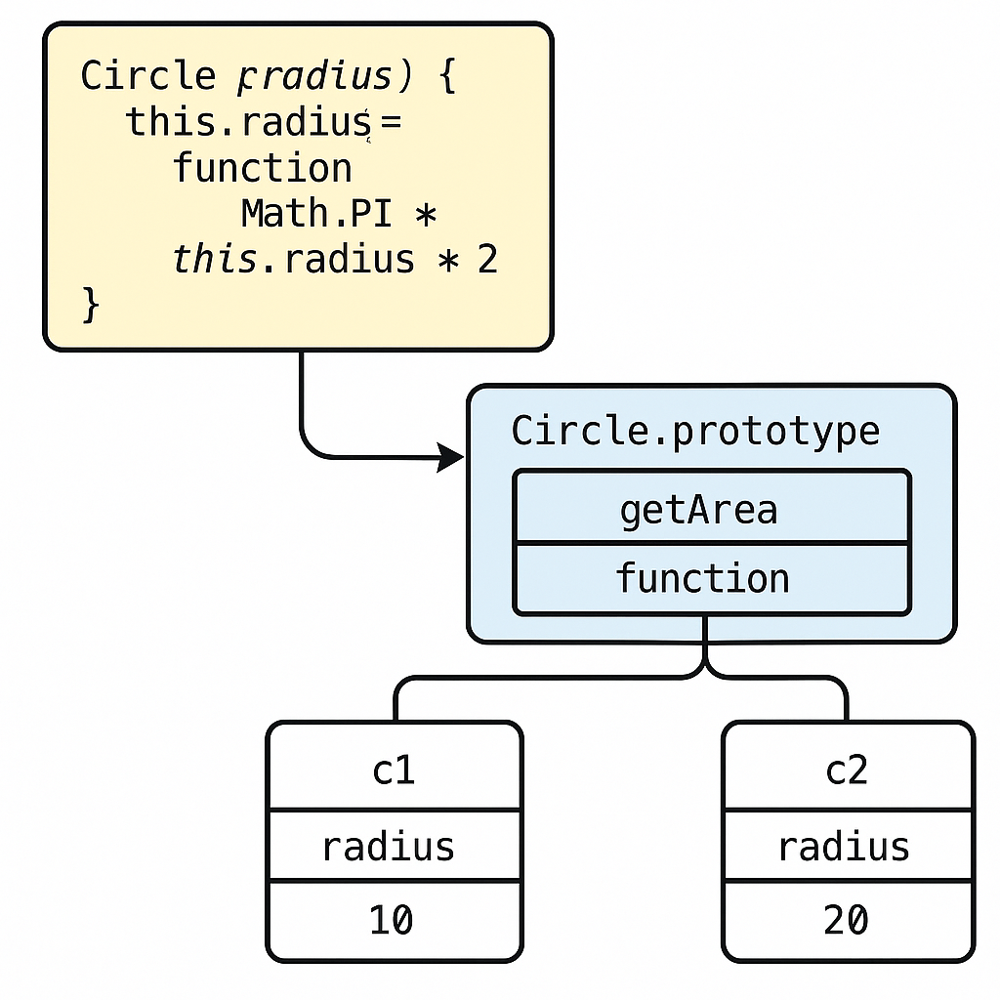

# 프로토타입

📌 *들어가기 전에*,

어느새 프로토타입에 도달했다.
<br>슬쩍 봤는데 와.. 너무 어렵다..... 이해가 잘 가지 않아 몇 번 씩 반복해서 읽어야겠다.

## 프로토타입 공부 전에,
- 자바스크립트는 **프로토타입 기반 객체지향 언어**다.
- 객체는 다른 객체를 **프로토타입으로 연결**해서 상속한다. (프로토타입 체인)

### 관련 용어 정리
| 용어           | 설명                                          |
|--------------|---------------------------------------------|
| 인스턴스         | **클래스로부터 생성된 객체**                           |
| `.prototype` | 생성자 함수가 가진 속성. 인스턴스들이 참조할 공통 메서드 저장소        |
| `__proto__`  | 모든 객체가 가진 내부 링크. 자기 객체의 프로토타입을 가리킴          |
| 프로토타입 체인     | 객체(자기 자신) → 프로토타입 → 그 상위 프로토타입으로 이어지는 참조 구조 |

<br>

## 프로토타입이란?
- 모든 함수(생성자 포함)는 `.prototype`이라는 속성을 가지고 있다.
- 이 `.prototype` 객체에 메서드를 정의하면, 그 생성자로 만든 인스턴스들이 **공통으로 그 메서드를 사용 할 수 있다.**
- **메모리 절약 + 기능 공유 + 유지보수 용이**
```js
function Circle(radius) {
    this.radius = radius;
}

Circle.prototype.getArea = function() {
    return Math.PI * this.radius ** 2;
};

const c1 = new Circle(10);
const c2 = new Circle(20);

c1.getArea();
c2.getArea();

console.log(c1.getArea === c2.getArea); // true
```
> 처음 `Circle()` 생성자 함수에 `getArea()`메서드를 등록하지 않고, `.prototype`을 이용해 등록해서 프로토타입을 이용
> <br> => `Circle`객체를 새로 생성할때마다 `getArea`가 생성되지 않으므로 메모리 절약
> <br>
> <br>쉽게 말하면, 프로토타입은 공용공간 `getArea`는 공용 도구.
> <br>but, 생성자 함수에 `getArea`를 저장하게 될 경우 `getArea`는 객체 하나하나마다 각자 도구.



<br>

## ES6, 클래스
ES6에서 클래스 문법이 생겼다.
<br>기존의 "프로토타입 기반 상속"을 더 보기 쉽고 쓰기 쉽게 만든 "문법적 설탕"이다.
```js
class Circle {
    constructor(radius) {
        this.radius = radius;
    }
    
    getArea() {
        return Math.PI * this.radius ** 2;
    }
}
```
- 클래스 문법은 **프로토타입 기반을 보기 쉽게 만든 문법**이다.
- `getArea()`는 내부적으로 `Circle.prototype.getArea`에 등록된다.
- 인스턴스는 이 메서드를 **프로토타입 체인**을 통해 참조한다.

<br>

## 🛠️ 실무에서는 어떻게 쓰이나?
| 항목           | 설명                         |
|--------------|----------------------------|
| 직접 사용하는 경우   | 거의 없음(구형 코드, 커스텀 상속 구현 시)  |
| 간접적으로 쓰이는 경우 | `map`, `filter`, `push` 등  |
| class 문법 내부  | 내부적으로는 여전히 prototype 기반 상속 |